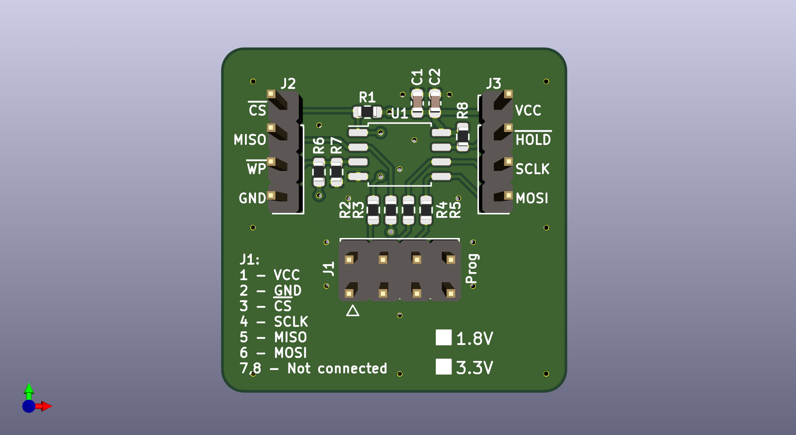

# SPI NOR Flash ROM Breakout Board

Small breakout board for SPI NOR Flash ROM chips in SOP-8 package

# Features

- supports most standard NOR Flash chips in SOP-8 package
- standard 8-pin ISP header with bus termination resistors (if needed)
- pin headers exposing each signal for testing
- pull-up resistors for /CS, /WP and /HOLD signals
- optional pull-down for /WP signal

Designed in KiCad 5.1.7

Schematic: [PDF](docs/spi-flash-breakout.pdf)

License: [CC BY-SA 4.0](https://creativecommons.org/licenses/by-sa/4.0/)
